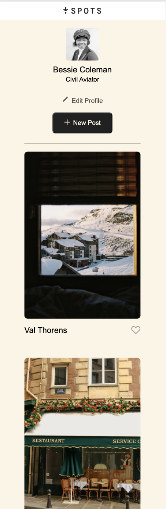

# Project 3: Spots

### Overview  

* Intro  
* Figma  
* Images  
  
**Intro**
  
This project is made so all the elements are displayed correctly on popular screen sizes. We recommend investing more time in completing this project, since it's more difficult than previous ones.  
  
**Figma**  
  
* [Link to the project on Figma](https://www.figma.com/file/BBNm2bC3lj8QQMHlnqRsga/Sprint-3-Project-%E2%80%94-Spots?type=design&node-id=2%3A60&mode=design&t=afgNFybdorZO6cQo-1)
  
**Images**  
  
The way you'll do this at work is by exporting images directly from Figma — we recommend doing that to practice more. Don't forget to optimize them [here](https://tinypng.com/), so your project loads faster. 
  
Good luck and have fun!

## Project Name
SE Project Spots

## Project Description and functionality:
an interactive image-sharing application where users can add and remove photos, photos from other users, and also make minor adjustments to their profile.

## Technologies used: 
Figma, HTML, CSS, GRID, FlexBox

## Images
The below image is a snapshot of the webpage from a mobile device

## Link to deployed project:
https://daynaj01.github.io/se-project-spots

## Link to project pitch video
https://drive.google.com/file/d/1pBZ73SYc9-rZwk8SOcUVaPo4iQeQks5v/view?usp=sharing

